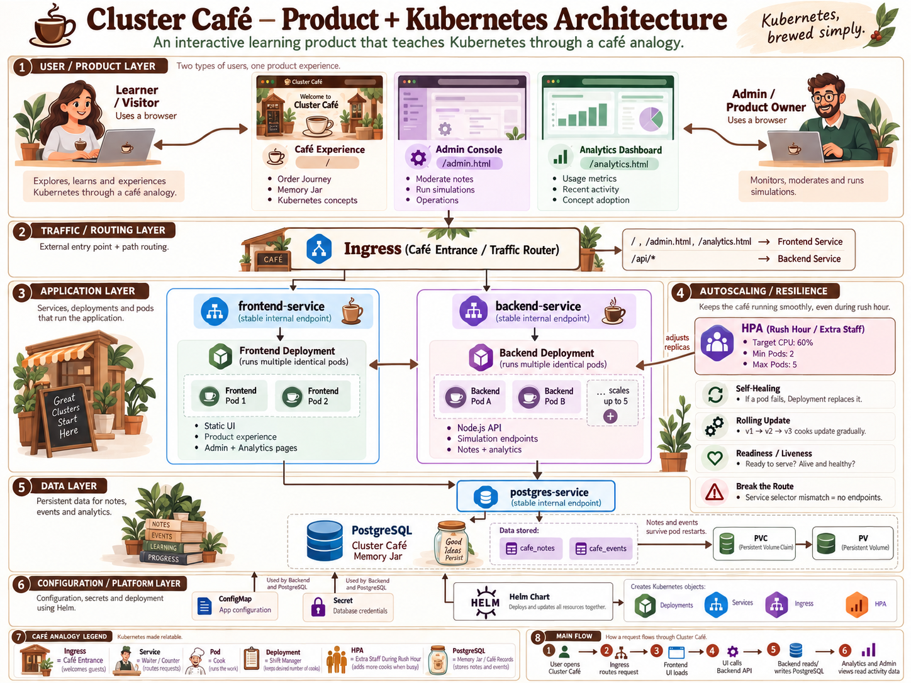
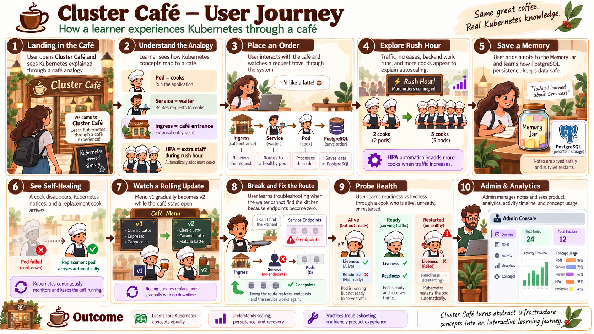

# ☕ Cluster Café

**Kubernetes, brewed simply.**

Cluster Café is an interactive Kubernetes learning application that explains infrastructure concepts through the familiar mental model of running a café.

Instead of only reading definitions such as *Pod*, *Service*, *Ingress*, *HPA*, or *Persistent Volume*, users can interact with café-based demonstrations that explain how those components work together.

The application itself runs on Kubernetes using Helm, so the project combines:

- a working three-tier application
- Kubernetes infrastructure
- PostgreSQL persistence
- autoscaling
- health checks
- troubleshooting scenarios
- admin tooling
- product analytics
- interactive learning simulations

---

## Architecture Diagram

<p align="center">
  
</p>

---

## User Journey

<p align="center">
  
</p>

---

# Product Idea

Kubernetes concepts are often taught independently:

```text
Pod
Service
Ingress
Deployment
HPA
PVC
ConfigMap
Secret
```

The harder part for beginners is understanding how these pieces work **together**.

Cluster Café maps them to café operations:

| Kubernetes | Cluster Café |
|---|---|
| Ingress | Café entrance |
| Service | Waiter / order counter |
| Pod | Cook |
| Deployment | Shift manager |
| HPA | Extra staff during rush hour |
| ConfigMap | Staff notice board |
| Secret | Locked manager drawer |
| PostgreSQL | Café memory / records |
| PVC / PV | Pantry / persistent storage |

The analogy is only the learning layer. The application still teaches the real Kubernetes terminology and behavior.

---

# User Experience

A learner can:

1. Open Cluster Café.
2. Understand Kubernetes through the café analogy.
3. Follow an order through the system.
4. Trigger a Rush Hour demonstration.
5. See cooks increase to explain HPA.
6. Save notes into the PostgreSQL-backed Memory Jar.
7. Explore self-healing.
8. Watch a RollingUpdate as menu versions change.
9. Break and restore a Service route.
10. Compare readiness and liveness failures.

Cluster Café also contains internal product surfaces:

```text
/
→ learner / café experience

/admin.html
→ operations, Memory Jar management and simulations

/analytics.html
→ product analytics and activity
```

---

# Architecture

```text
                         User
                          |
                          v
                    NGINX Ingress
                    /           \
                   /             \
                  v               v
        frontend-service     backend-service
               |                   |
               v                   v
        Frontend Pods          Backend Pods
                                   |
                                   v
                            postgres-service
                                   |
                                   v
                              PostgreSQL
                                   |
                                   v
                                  PVC
                                   |
                                   v
                                   PV
```

Ingress routes:

```text
/                -> frontend-service:3000
/admin.html      -> frontend-service:3000
/analytics.html  -> frontend-service:3000
/api/*           -> backend-service:8080
```

Backend and PostgreSQL remain internal using ClusterIP Services.

---

# Tech Stack

## Application

- HTML
- CSS
- Vanilla JavaScript
- Node.js
- Express
- PostgreSQL

## Infrastructure

- Docker
- Kubernetes
- Minikube
- Helm
- NGINX Ingress Controller
- Kubernetes Metrics Server

---

# Repository Structure

```text
kubernetes-harsh-project/
│
├── frontend/
│   ├── Dockerfile
│   ├── package.json
│   ├── server.js
│   │
│   └── public/
│       ├── index.html
│       ├── styles.css
│       ├── app.js
│       ├── admin.html
│       ├── admin.css
│       ├── admin.js
│       ├── analytics.html
│       ├── analytics.css
│       └── analytics.js
│
├── backend/
│   ├── Dockerfile
│   ├── package.json
│   └── server.js
│
├── production-app/
│   ├── Chart.yaml
│   ├── values.yaml
│   └── templates/
│       ├── frontend-deployment.yaml
│       ├── frontend-service.yaml
│       ├── backend-deployment.yaml
│       ├── backend-service.yaml
│       ├── backend-hpa.yaml
│       ├── postgres-deployment.yaml
│       ├── postgres-service.yaml
│       ├── postgres-configmap.yaml
│       ├── postgres-secret.yaml
│       ├── postgres-pv.yaml
│       ├── postgres-pvc.yaml
│       └── ingress.yaml
│
├── assets/
│   └── diagrams/
│       ├── cluster-cafe-architecture.png
│       └── cluster-cafe-user-journey.png
│
├── troubleshooting/
├── product/
├── ai-context/
├── AGENTS.md
└── README.md
```

---

# Kubernetes Design

## Namespace

Everything runs inside:

```text
production-app
```

This keeps application resources logically grouped and isolated.

---

## Frontend

The frontend Deployment contains the Cluster Café user experience.

It includes:

- main café website
- Admin Console
- Analytics Dashboard
- learning simulations

The frontend uses:

- multiple replicas
- resource requests and limits
- readiness probe
- liveness probe
- RollingUpdate deployment strategy
- internal ClusterIP Service

Service:

```text
frontend-service
```

Port:

```text
3000
```

---

## Backend

The backend is a Node.js / Express API.

It handles:

- health checks
- PostgreSQL access
- Memory Jar notes
- Admin actions
- analytics events
- CPU-load generation for HPA demonstrations

The backend uses:

- minimum 2 replicas
- resource requests and limits
- readiness probe
- liveness probe
- RollingUpdate
- ClusterIP Service
- Horizontal Pod Autoscaler

Service:

```text
backend-service
```

Port:

```text
8080
```

---

# PostgreSQL

PostgreSQL stores:

```text
cafe_notes
cafe_events
```

## `cafe_notes`

Stores Memory Jar content.

Important fields include:

```text
id
message
author_name
category
status
is_pinned
is_featured
created_at
updated_at
deleted_at
```

Notes support a simple lifecycle:

```text
ACTIVE
  |
  +---- Hide ----> HIDDEN
  |                  |
  |                Restore
  |                  |
  +<-----------------+
  |
  +---- Delete ----> DELETED
```

Delete is implemented as a soft delete.

---

## `cafe_events`

Stores product and simulation activity.

Example events:

```text
note_created
note_hidden
note_deleted
note_pinned
note_unpinned

rush_hour_started
rush_hour_completed

self_heal_simulation_started
self_heal_simulation_completed

rolling_update_started
rolling_update_completed

route_broken
route_restored

readiness_failed
readiness_restored

liveness_failed
liveness_recovered
```

This data powers the Analytics Dashboard and activity timeline.

---

# Memory Jar

The Memory Jar demonstrates persistent data.

Flow:

```text
User writes note
      |
      v
POST /api/notes
      |
      v
Backend Pod
      |
      v
postgres-service
      |
      v
PostgreSQL
      |
      v
Persistent Storage
```

The note survives temporary application Pod changes because it is stored in PostgreSQL rather than frontend/backend Pod memory.

---

# Admin Console

Open:

```text
http://127.0.0.1/admin.html
```

The Admin Console demonstrates internal product tooling.

Current capabilities include:

- view notes
- search notes
- filter by status
- filter by category
- pin / unpin
- hide
- restore
- soft delete
- view activity
- run learning simulations

This demonstrates both database operations and internal product workflows.

---

# Analytics Dashboard

Open:

```text
http://127.0.0.1/analytics.html
```

The Analytics Dashboard aggregates actual PostgreSQL event data.

Current views include:

- total simulations
- Memory Jar usage
- Rush Hour runs
- most explored concept
- concept usage
- active / hidden / pinned notes
- recent activity

This provides a lightweight product analytics layer rather than using hardcoded dashboard numbers.

---

# Interactive Kubernetes Demonstrations

## 1. Order Journey

The café metaphor explains a request as:

```text
Customer
   |
   v
Ingress
(Café entrance)
   |
   v
Service
(Waiter)
   |
   v
Backend Pod
(Cook)
   |
   v
PostgreSQL
(Café memory)
```

---

## 2. Rush Hour — HPA

The UI creates backend CPU work through:

```text
/api/work
```

Visual explanation:

```text
customers increase
      |
      v
load increases
      |
      v
2 cooks
      |
      v
3 -> 4 -> 5 cooks
```

The real Kubernetes behavior can be observed using:

```powershell
kubectl get hpa -n production-app -w
```

and:

```powershell
kubectl get pods -n production-app -w
```

Backend HPA:

```text
Minimum replicas: 2
Maximum replicas: 5
Target CPU: 60%
```

The visual cook count is an educational representation. Real HPA state should be verified through Kubernetes.

---

## 3. Self-Healing

Visual analogy:

```text
cook disappears
      |
      v
shift manager notices
      |
      v
replacement cook appears
```

Real Kubernetes demonstration:

```powershell
kubectl get pods -n production-app -w
```

Then delete a backend Pod:

```powershell
kubectl delete pod <backend-pod-name> -n production-app
```

The Deployment maintains desired state and creates a replacement.

---

## 4. Rolling Update

Cluster Café represents deployments as menu releases.

```text
v1 cook + v1 cook

       |
       v

v1 cook + v2 cook

       |
       v

v2 cook + v2 cook
```

The simulation supports repeated releases:

```text
v1 -> v2
v2 -> v3
v3 -> v4
...
```

The number of cooks remains stable while workers are replaced progressively.

Frontend and backend Kubernetes Deployments use RollingUpdate.

---

## 5. Break the Waiter Route

This demonstrates a Service selector mismatch.

Healthy case:

```text
Service
   |
   v
2 endpoints
   |
   v
Backend Pods
```

Broken case:

```text
Service
   |
   v
0 endpoints
   |
   X
Backend Pods are still healthy
```

The lesson:

> A Service can exist while still being unable to route traffic if its selector does not match Pod labels.

Useful commands:

```powershell
kubectl get pods -n production-app --show-labels
kubectl describe service backend-service -n production-app
kubectl get endpoints backend-service -n production-app
```

---

## 6. Readiness vs Liveness

### Readiness

Question:

> Should this Pod receive traffic?

Simulation:

```text
Cook alive
Readiness FAILED
        |
        v
Service stops sending new orders
```

### Liveness

Question:

> Is the application still functioning?

Simulation:

```text
Liveness FAILED
      |
      v
container restart
      |
      v
healthy worker returns
```

---

# Persistent Storage

PostgreSQL uses:

```text
PostgreSQL Pod
      |
      v
     PVC
      |
      v
      PV
      |
      v
/data/postgres
```

Configuration:

```text
Size: 2Gi
Access mode: ReadWriteOnce
Reclaim policy: Retain
```

`hostPath` is used because this project runs locally through Minikube.

For a real cloud deployment, CSI-backed storage would normally be used instead.

`Retain` reduces accidental storage deletion but is **not a database backup strategy**.

---

# Database Scheduling

PostgreSQL demonstrates:

- Node Affinity
- Taints
- Tolerations

Database node label:

```text
workload=database
```

Example:

```powershell
kubectl label node minikube workload=database --overwrite
```

Database-specific taint:

```powershell
kubectl taint node minikube dedicated=database:NoSchedule
```

PostgreSQL contains the matching toleration.

Conceptually:

```text
Node Affinity
= where PostgreSQL should run

Toleration
= permission for PostgreSQL to run on a tainted node
```

Because local Minikube uses one node, the taint should only be used temporarily for demonstration.

Remove it using:

```powershell
kubectl taint node minikube dedicated=database:NoSchedule-
```

---

# ConfigMap and Secret

Non-sensitive configuration is handled through ConfigMaps.

Examples:

```text
DB_HOST
DB_PORT
DB_NAME
```

Sensitive database credentials are provided through Kubernetes Secrets.

Examples:

```text
POSTGRES_USER
POSTGRES_PASSWORD
```

Real credentials must never be committed to Git.

Kubernetes Secret values being base64-encoded should not be confused with encryption.

---

# Helm

Cluster Café is deployed using Helm.

Chart:

```text
production-app/
```

Flow:

```text
values.yaml
     |
     v
Helm templates
     |
     v
Rendered Kubernetes resources
     |
     v
Kubernetes cluster
```

Preview rendered resources:

```powershell
helm template production-app ./production-app
```

Install or upgrade:

```powershell
helm upgrade --install production-app ./production-app `
  -n production-app
```

During the original migration from `kubectl apply` to Helm, some resources retained old field ownership.

If needed during this local project:

```powershell
helm upgrade production-app ./production-app `
  -n production-app `
  --force-conflicts
```

This is a migration cleanup mechanism rather than normal production deployment practice.

---

# Running Locally

## Prerequisites

Install:

- Docker
- kubectl
- Minikube
- Helm

Verify:

```powershell
docker --version
kubectl version --client
minikube version
helm version
```

---

## Start Minikube

```powershell
minikube start
```

Verify:

```powershell
minikube status
kubectl get nodes
```

---

## Required Addons

Enable Ingress:

```powershell
minikube addons enable ingress
```

Enable Metrics Server:

```powershell
minikube addons enable metrics-server
```

---

# Building Images

Example backend build:

```powershell
docker build --no-cache -t production-backend:<version> ./backend
minikube image load production-backend:<version>
```

Example frontend build:

```powershell
docker build --no-cache -t production-frontend:<version> ./frontend
minikube image load production-frontend:<version>
```

Update the corresponding tags inside:

```text
production-app/values.yaml
```

Then deploy with Helm.

Use new tags for meaningful deployable checkpoints instead of rebuilding repeatedly under the same tag.

---

# Deploy

```powershell
helm upgrade production-app ./production-app `
  -n production-app `
  --force-conflicts
```

Verify:

```powershell
kubectl rollout status deployment/frontend -n production-app
kubectl rollout status deployment/backend -n production-app
kubectl rollout status deployment/postgres -n production-app
```

---

# Access the Application

Run in a separate PowerShell window:

```powershell
minikube tunnel
```

Keep it running.

Open:

```text
Main application:
http://127.0.0.1/

Admin:
http://127.0.0.1/admin.html

Analytics:
http://127.0.0.1/analytics.html
```

API health:

```powershell
Invoke-RestMethod http://127.0.0.1/api/status
```

Memory Jar:

```powershell
Invoke-RestMethod http://127.0.0.1/api/notes
```

Analytics:

```powershell
Invoke-RestMethod http://127.0.0.1/api/admin/analytics |
  ConvertTo-Json -Depth 6
```

---

# Troubleshooting Scenarios

Intentional troubleshooting scenarios demonstrate real Kubernetes failure modes.

## Pod Scheduling Failure

Incorrect PostgreSQL affinity can result in:

```text
No eligible node
      |
      v
PostgreSQL Pod Pending
```

Investigate with:

```powershell
kubectl describe pod <pod-name> -n production-app
kubectl get nodes --show-labels
```

---

## Service Selector Failure

Incorrect selector:

```text
Healthy Backend Pods
       |
       X
backend-service
       |
       v
No endpoints
```

Investigate:

```powershell
kubectl get endpoints backend-service -n production-app
kubectl get pods -n production-app --show-labels
kubectl describe service backend-service -n production-app
```

---

# Useful Verification Commands

Application resources:

```powershell
kubectl get all -n production-app
```

Pods:

```powershell
kubectl get pods -n production-app -o wide
```

Services:

```powershell
kubectl get svc -n production-app
```

Ingress:

```powershell
kubectl get ingress -n production-app
```

Storage:

```powershell
kubectl get pv
kubectl get pvc -n production-app
```

HPA:

```powershell
kubectl get hpa -n production-app
```

Logs:

```powershell
kubectl logs deployment/backend -n production-app
kubectl logs deployment/frontend -n production-app
kubectl logs deployment/postgres -n production-app
```

Pod investigation:

```powershell
kubectl describe pod <pod-name> -n production-app
```

---

# Node Autoscaling

HPA handles:

```text
Pod scaling
```

A cloud production environment could additionally use:

```text
Cluster Autoscaler
or
Karpenter
```

Relationship:

```text
Traffic increases
       |
       v
HPA requests more Pods
       |
       v
Cluster lacks capacity
       |
       v
Node autoscaler creates capacity
```

Node autoscaling is documented conceptually because this project runs on single-node Minikube.

---

# Product Analytics Direction

Cluster Café also serves as a small product case study.

Potential product questions include:

- Which concepts are explored most?
- How many users start interactive demonstrations?
- Which simulations are repeatedly used?
- Are learners interacting with persistence?
- Where do users drop out of the learning journey?

Current PostgreSQL event tracking creates the foundation for these questions.

Possible future metrics:

```text
Activation
= learner completes 2+ interactive demonstrations

Time to value
= landing -> first successful demo

Engagement
= demonstrations per learning session

Learning completion
= percentage completing the guided journey
```

---

# Future Improvements

Potential improvements include:

- guided onboarding
- Break the Café troubleshooting game
- learning progress
- user testing
- richer event analytics
- session tracking
- authentication for Admin
- NetworkPolicies
- PodDisruptionBudgets
- CI/CD
- cloud Kubernetes deployment
- managed PostgreSQL
- Prometheus / Grafana
- centralized logging
- custom domain and TLS

These should only be added when they strengthen either:

1. Kubernetes learning,
2. the product experience,
3. technical understanding,
4. or the portfolio story.

---

# Key Design Decisions

- Helm manages Kubernetes resources.
- Ingress is the external HTTP routing layer.
- Backend and PostgreSQL remain internal.
- Frontend and backend are stateless and horizontally scalable.
- PostgreSQL intentionally uses one replica.
- PostgreSQL uses persistent storage.
- Backend uses HPA for variable application load.
- RollingUpdate provides gradual releases.
- Readiness prevents traffic reaching unready Pods.
- Liveness helps recover unhealthy containers.
- Database scheduling demonstrates affinity and tolerations.
- Product simulations explain concepts without granting the frontend dangerous cluster-control permissions.
- Real infrastructure behavior and educational simulations are clearly distinguished.

---

# Summary

Cluster Café combines:

```text
PRODUCT
├── learner experience
├── admin tooling
├── analytics
└── interactive demonstrations

APPLICATION
├── frontend
├── backend
└── PostgreSQL

KUBERNETES
├── Deployments
├── Services
├── Ingress
├── ConfigMaps
├── Secrets
├── PV / PVC
├── HPA
├── probes
├── scheduling
└── RollingUpdate

LEARNING
├── request routing
├── autoscaling
├── persistence
├── self-healing
├── rolling updates
├── Service failures
└── health probes
```

The project is intended not only to show that Kubernetes resources can be created, but to make the behavior of those resources understandable through an interactive product experience.